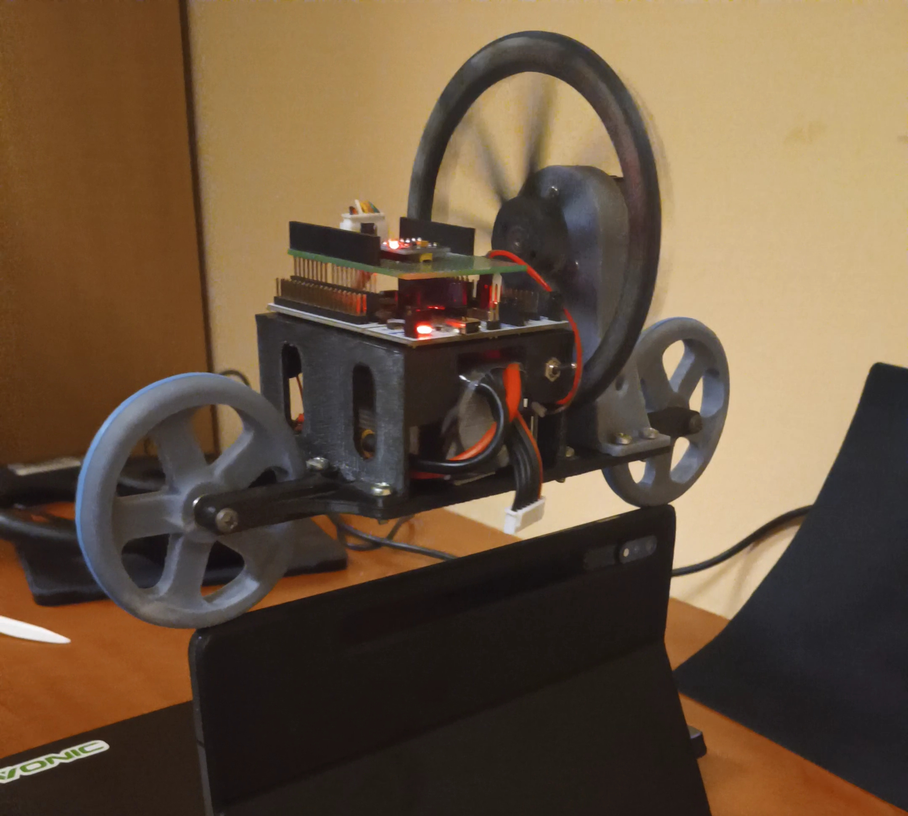
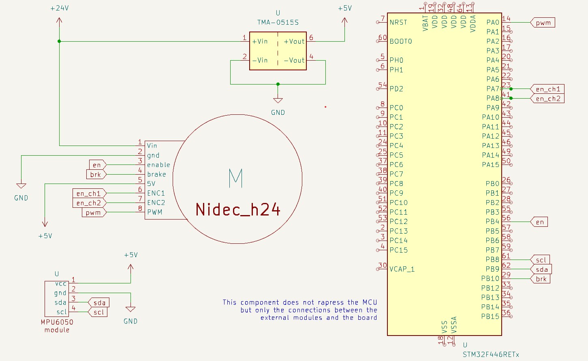

## About the Project
This project involves the development of a self-balancing bicycle designed to remain stable in
a stationary position on a flat surface. The balance is autonomously maintained through a
reaction wheel powered by a motor, whose controlled movement counteracts the bicycle’s tilt.
For small tilt angles, the system can be approximated as an inverted pendulum.
The structure was created using 3D printing and then assembled, following a preliminary modeling phase in SolidWorks.

The control system relies on precise timing: A main timer manages a callback triggered at
defined time intervals, while a second timer regulates the generation of the PWM signal needed
to control the motor. An additional timer has been set up for reading the encoder data. As for
the data from the IMU, it is acquired via the I2C protocol.

The control model is structured with two loops. The inner loop uses encoder data to implement
closed-loop speed control, while the outer loop relies on IMU readings to adjust the position.
To achieve an accurate angle reading, sensor data fusion has been implemented through a filter
that combines information from an MPU6050 IMU, equipped with an integrated accelerometer
and gyroscope.

## Schematic

## Additional info
Check out the report if you are interested in our work!

[Link to the report](SELF_BALANCING_BIKE_REPORT.pdf)

[Link to the pinout and configuration](pinout_and_config_report.pdf)

🚀 Happy coding! 🌟
